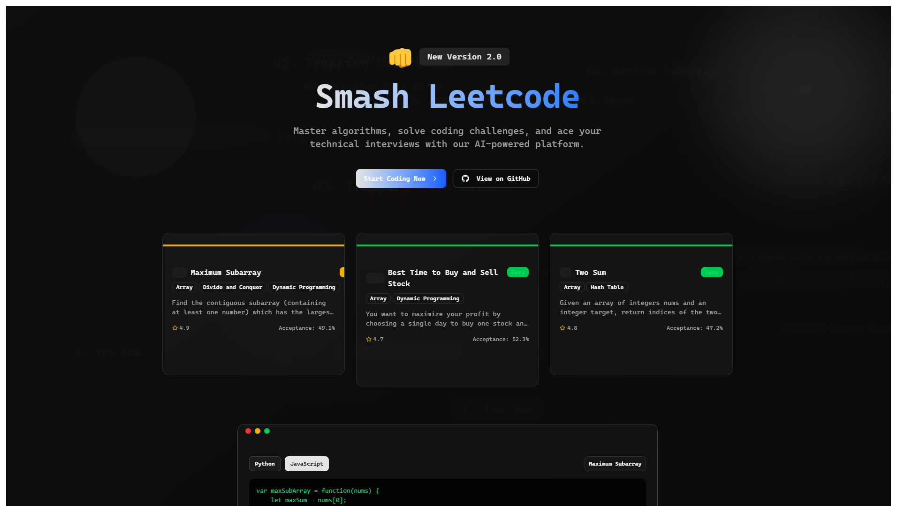

# 👊 Smash LeetCode

A modern, AI-powered platform to help you master coding challenges and ace your technical interviews.



## 🌟 Overview

Smash LeetCode is my passion project built to make the process of learning algorithms and data structures more intuitive and enjoyable. As someone who's gone through the grind of technical interviews, I wanted to create a tool that I wish I had during my own preparation journey.

This app combines the best of LeetCode-style problems with an AI assistant that can:
- Generate optimized solutions in multiple programming languages
- Provide step-by-step explanations of algorithms
- Give personalized hints when you're stuck
- Analyze your code and suggest improvements

## ✨ Features

### 💻 Curated Coding Challenges
- 200+ hand-picked problems covering essential algorithms and data structures
- Problems organized by difficulty (Easy, Medium, Hard) and topic tags
- Detailed problem descriptions with examples and constraints

### 🤖 AI-Powered Solutions
- Generate solutions in Python, JavaScript, Java, C++, and more
- Multiple solution approaches with time and space complexity analysis
- Step-by-step explanations in plain English

### 🎯 Interactive Learning
- Code editor with syntax highlighting
- Customizable generation options for different solution approaches
- Real-time chat interface for asking questions about problems

### 📊 Progress Tracking
- Track your solved problems and success rate
- Identify strengths and weaknesses by topic
- Focus on improving specific areas

## 🛠️ Tech Stack

I built this application using modern technologies to ensure a smooth, responsive experience:

### Frontend
- **React** with **TypeScript** for type safety
- **Tailwind CSS** with shadcn/ui components for a sleek UI
- **Framer Motion** for smooth animations
- **Redux Toolkit** for state management

### Backend
- **FastAPI** for high-performance API endpoints
- **SQLAlchemy** for database interactions
- **LangChain** for LLM orchestration
- **OpenAI API** (GPT-4o models) for AI assistance

## 🚀 Getting Started

### Prerequisites
- Node.js 18+
- Python 3.12+
- OpenAI API key

### Installation

#### Client Setup
```bash
# Navigate to client directory
cd client

# Install dependencies
npm install

# Start development server
npm run dev
```

#### Server Setup
```bash
# Navigate to server directory
cd server

# Create and activate virtual environment
python -m venv venv
source venv/bin/activate  # On Windows: venv\Scripts\activate

# Install dependencies
pip install -r requirements.txt
# Or if using Poetry
poetry install

# Set up environment variables
cp .env.example .env
# Edit .env with your OpenAI API key

# Start the server
python -m src.main
```

## 📝 Project Structure

```
smash-leetcode/
├── client/                # React frontend
│   ├── src/
│   │   ├── components/    # React components
│   │   ├── store/         # Redux store
│   │   ├── config/        # Configuration files
│   │   └── lib/           # Utility functions
│   └── public/            # Static assets
└── server/                # FastAPI backend
    ├── src/
    │   ├── llm/           # LLM integration
    │   ├── problems/      # Problem definitions
    │   ├── solution/      # Solution generation
    │   ├── db/            # Database models
    │   ├── cache/         # Caching utilities
    │   └── routes/        # API endpoints
    └── tests/             # Backend tests
```

## 🎨 UI Showcase

### Problem List View


### Problem Detail View


### Solution Generation


## 🤝 Contributing

I'd love your contributions to make Smash LeetCode even better! Here's how you can help:

1. Fork the repository
2. Create your feature branch (`git checkout -b feature/amazing-feature`)
3. Commit your changes (`git commit -m 'Add some amazing feature'`)
4. Push to the branch (`git push origin feature/amazing-feature`)
5. Open a Pull Request

### Development Guidelines
- Follow the existing code style
- Write meaningful commit messages
- Add comments for complex logic
- Test your changes thoroughly

## 📈 Future Plans

I'm constantly working to improve Smash LeetCode. Some features I'm planning to add:

- User accounts and progress tracking
- Code execution and test cases
- Spaced repetition system for efficient learning
- Interview simulation mode
- Community features (discussions, user-submitted solutions)
- Mobile app version

## 🔒 License

This project is licensed under the MIT License - see the LICENSE file for details.

## 🙏 Acknowledgements

I couldn't have built this without these amazing resources:

- [LeetCode](https://leetcode.com/) for inspiration
- [OpenAI](https://openai.com/) for their powerful GPT models
- [shadcn/ui](https://ui.shadcn.com/) for beautiful UI components
- [FastAPI](https://fastapi.tiangolo.com/) for the robust backend framework
- And all the open-source libraries that made this possible!

---

If you find this project helpful, please consider giving it a star! ⭐ 
Feel free to reach out if you have any questions or suggestions.

Happy coding! 🚀